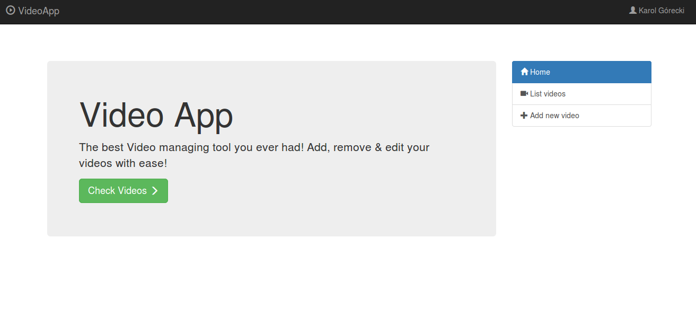
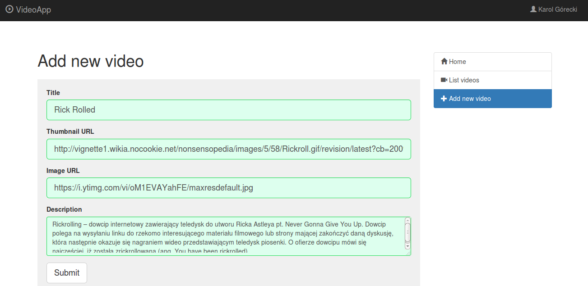
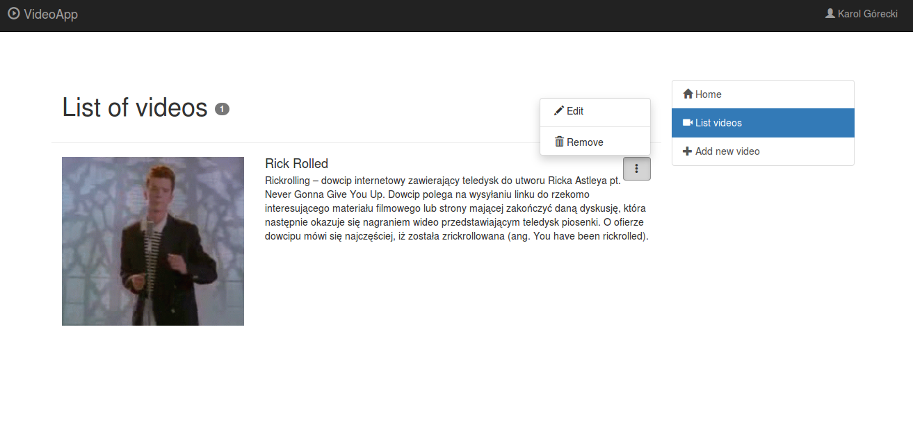
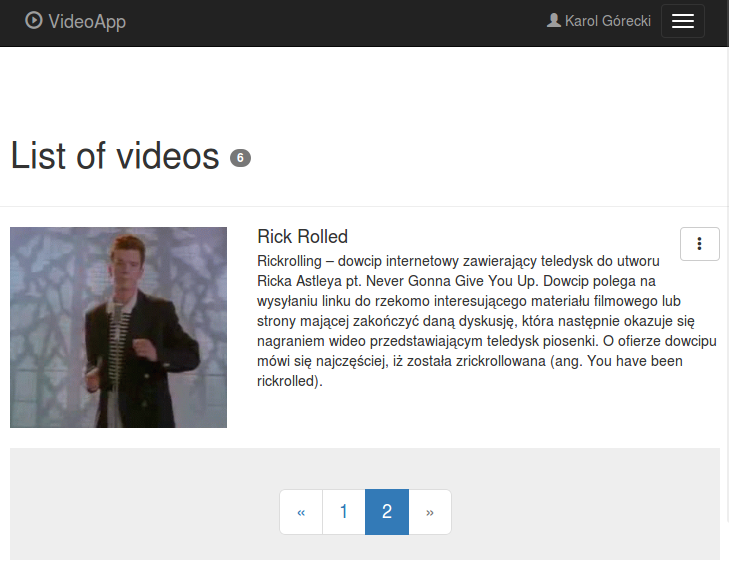

# Video App




## About project
Small demo application for managing videos build on ReactJS.

### Used stuff
- ReactJS
- es6/7/2015
- Webpack
- Eslint
- Esdoc
- Sass / Css modules
- Tests (Enzyme, Mocha, Chai, Karma, Nightwatch)

### Not used
Given the size of the project and the time to do this project I decided to keep it simple and not to overkill it with
fancy stuff. So I didn't use:
- Redux
- Server side rendering
- PostCSS + plugins

### Improvements
Future improvements:
- improve unit tests
- refactor & add more functional tests
- refactor some parts of code to keep it DRY
- add real documentation
- work a little bit on RWD
- use Boostrap components for React or even use Material UI
- make it more personalized

## Running project

### Install
```
npm install
```

### Run dev
To run dev version on `http://localhost:8080` run:
```
npm start
```

### Run build
Build creates `build` folder in the root directory. It can be used with `index.html`.
```
npm run build
```

### Tests
[](https://circleci.com/gh/karolgorecki/video-app/tree/dev)

Running unit tests
```
npm test
```

To run functional tests you should have installed `Nightwatch` and running `Selenium` server. After this simply run:
```
nightwatch
```

### Generate documentation
To generate esDoc use:
```
npm run doc
```
